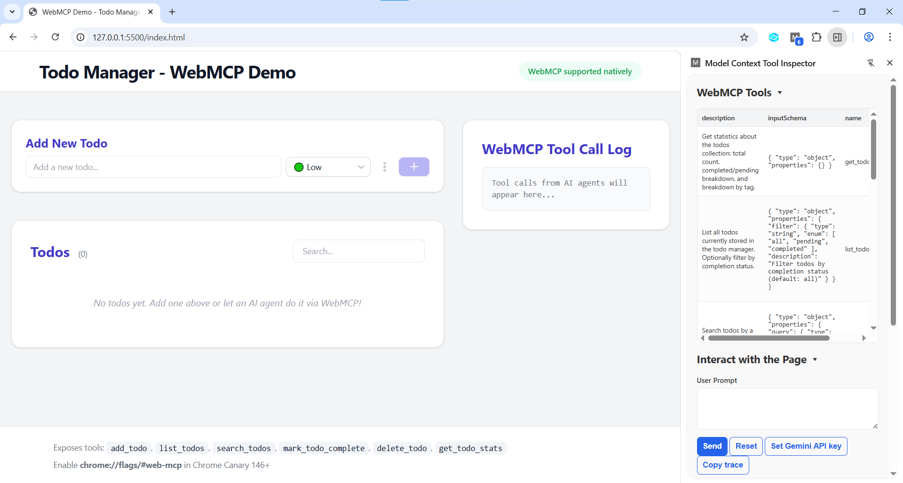
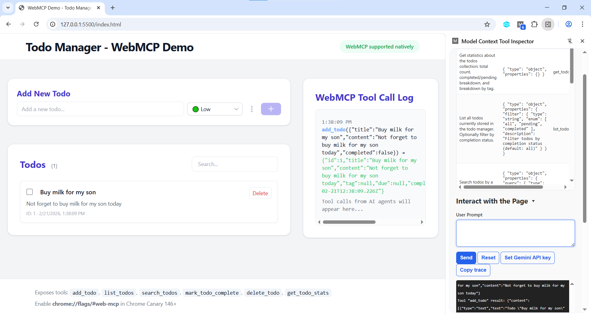

# WebMCP Demo



## What's WebMCP?

WebMCP brings [Anthropic's MCP](https://modelcontextprotocol.io/) into the browser. Where MCP connects agents to backend services, WebMCP connects agents to in-page functionality reusing the user's session, auth, and visual context.

This app exposes todo management tools via `navigator.modelContext` so AI agents can discover and invoke them. Instead of scraping the DOM or simulating clicks, agents get a clean function interface users stay in control, and developers can build smarter, more secure integrations.

## Example Tool Registration

```js
navigator.modelContext.provideContext({
  tools: [
    {
      name: "add_todo",
      description: "Add a new todo to the todo manager.",
      inputSchema: {
        type: "object",
        properties: {
          title: { type: "string" },
          content: { type: "string" },
          tag: { type: "string", enum: ["low", "medium", "high"] },
          completed: { type: "boolean" },
        },
        required: ["title", "content"],
      },
      async execute({ title, content, tag, completed = false }) {
        // ...implementation...
      },
    },
    // ...other tools...
  ],
});
```

## Quickstart

1. **Clone and serve**
   ```sh
   git clone https://github.com/durmisi/WebMcpDemo.git
   cd WebMcpDemo
   python -m http.server 8080
   ```
2. **Open** `http://localhost:8080` in your browser.
3. **Try the tools from DevTools console:**
   ```js
   await window.__webmcp_tools.add_todo({
     title: "Buy milk",
     content: "Remember to buy milk",
     tag: "high",
   });
   await window.__webmcp_tools.list_todos({ filter: "all" });
   await window.__webmcp_tools.search_todos({ query: "milk" });
   await window.__webmcp_tools.mark_todo_complete({ id: 1, completed: true });
   await window.__webmcp_tools.delete_todo({ id: 1 });
   await window.__webmcp_tools.get_todo_stats({});
   ```
   These are the same functions that a browser AI agent would call through `navigator.modelContext` the console fallback lets you test without Chrome Canary.



## Enabling Native WebMCP

- **Chrome Canary (146+)**: Go to `chrome://flags/#web-mcp` → Enable → Restart. Status badge turns green.
- **MCP-B polyfill**: Install the [MCP-B extension](https://github.com/nichochar/mcp-b). Status badge turns yellow. Works in any browser.

## Tools Exposed

This demo registers 6 tools that manage a simple in-memory todo collection:

| Tool               | Description                                  | Input                            |
| ------------------ | -------------------------------------------- | -------------------------------- |
| add_todo           | Create a todo                                | title, content, tag?, completed? |
| list_todos         | List all todos (optionally filter)           | filter? (all/pending/completed)  |
| search_todos       | Search todos by query                        | query                            |
| mark_todo_complete | Mark a todo as completed/incomplete          | id, completed                    |
| delete_todo        | Delete a todo by ID                          | id                               |
| get_todo_stats     | Get stats: total, completed, pending, by tag |                                  |

## Key Patterns in the Code

- **Feature detection**: Checks `navigator.modelContext`, then polyfill, then console fallback.
- **requestUserInteraction**: `delete_todo` pauses to ask the user for confirmation before proceeding.
- **annotations.readOnlyHint**: Marks `get_todo_stats` as non-mutating so agents can call it freely.
- **Structured responses**: Tools return `{ content: [{ type: "text", text: "..." }] }` per the spec.
- **Tool call log**: Every invocation (from agent or console) is rendered in the UI for observability.

## Project Structure

```
WebMcpDemo/
├── index.html    # Page layout
├── style.css     # Dark-themed styling
├── docs/         # Demo screenshots and images
└── README.md     # You are here
```

## References & Further Reading

- [W3C WebMCP Spec](https://webmachinelearning.github.io/webmcp/)
- [WebMCP GitHub](https://github.com/webmachinelearning/webmcp)
- [WebMCP Proposal](https://github.com/webmachinelearning/webmcp/blob/main/docs/proposal.md)
- [MCP-B Polyfill](https://github.com/nichochar/mcp-b)
- [Chrome's WebMCP makes AI agents stop pretending](https://medium.com/reading-sh/chromes-webmcp-makes-ai-agents-stop-pretending-e8c7da1ba650)
- [WebMCP: Making the web AI-agent ready](https://techhub.iodigital.com/articles/web-mcp-making-the-web-ai-agent-ready)
